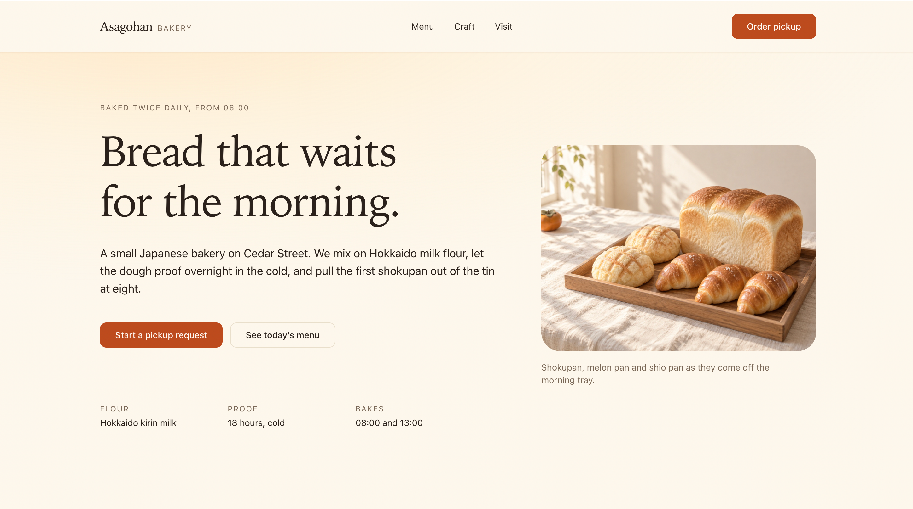
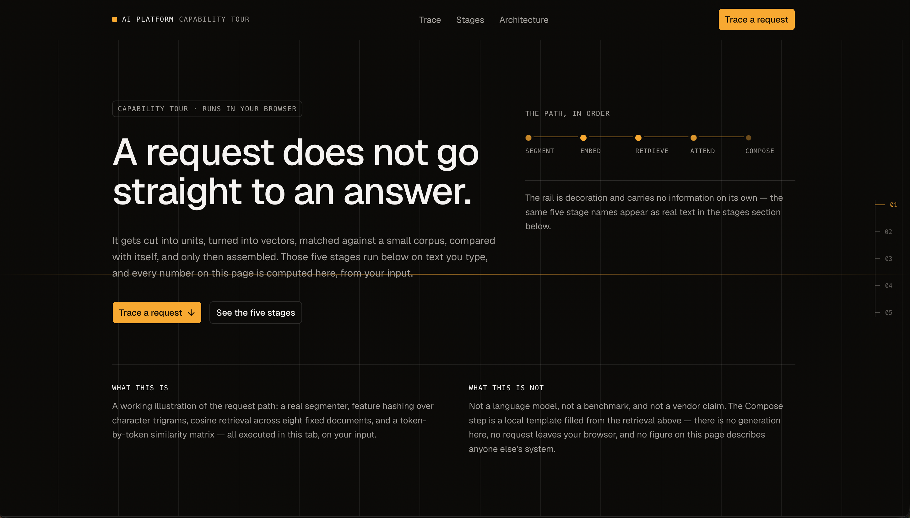
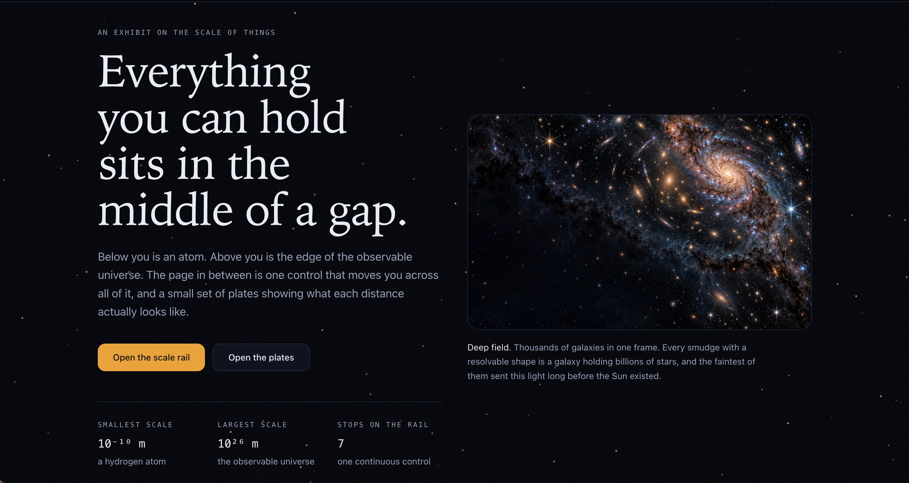

<div align="center">

# Component-Driven Frontend

### 将产品意图转化为经过验证、富有表现力的界面

<p>
  一个面向 Agent 的设计感知型 skill，用于规划和构建精致的 React 界面，
  通过组件验证、统一的视觉方向和响应式视觉验收保证实现质量。
</p>

<p>
  <a href="README.md">English</a>
  ·
  <a href="SKILL.md">Skill instructions</a>
</p>

</div>

<p align="center">
  
  
  
</p>

<p align="center">
  <em>三种视觉方向，一套基于证据的组件驱动工作流。</em>
</p>

## 这个 skill 解决什么问题

`component-driven-frontend` 帮助你把产品需求转化为可执行的组件方案，
并进一步实现为生产级界面。它适合那些需要认真处理组件选择、视觉语言、
页面构成、响应式行为和可访问性的前端任务。

它会：

- 在选择基础设计系统或组件前检查当前项目；
- 将产品意图转化为明确的视觉方向；
- 在不复制不可验证参考的前提下搜索灵感；
- 在推荐组件前验证项目内组件和外部来源 API；
- 限制实现使用一个基础设计系统，最多配合一个视觉增强器；
- 生成并校验机器可读的组件方案；
- 根据方案完成实现，并进行桌面端和移动端的渲染验收。

## 适用场景

以下场景适合使用这个 skill：

- 根据产品需求设计或实现 React 页面；
- 从现有设计系统或组件 Registry 中选择组件；
- 为新产品页面确定视觉方向；
- 组合 Dashboard、Landing Page、产品壳层或内容密集型界面；
- 处理需要响应式、可访问性和视觉系统判断的 UI 优化。

它不适用于 reducer 问题、状态流转 bug，或目标和值都已经明确的单行样式修改。

## 工作流

```text
检查项目现状
      ↓
设计意图与视觉方向
      ↓
内容、响应式与性能边界
      ↓
验证组件和来源
      ↓
校验组件方案
      ↓
沿用现有 token 实现
      ↓
桌面端/移动端渲染视觉验收
```

完整操作说明见 [`SKILL.md`](SKILL.md)。详细领域指导位于
[`references/`](references/)，确定性脚本和校验工具位于 [`scripts/`](scripts/)。

## 三种视觉方向

### Warmth

强调人与内容的连接，使用易接近的节奏、清晰的情绪意图和经过思考的内容组织，
避免界面看起来像机械拼装。

### AI Product

面向 AI 产品的聚焦型界面，优先保证层级、交互状态、信息密度和系统反馈的可信度，
而不是堆叠装饰。

### Science

面向科学与技术场景，通过克制的布局、证据、渐进式信息披露和稳定的响应式行为，
让复杂信息保持可读。

这些图片是视觉参考，不是组件来源。skill 使用它们讨论方向和意图，但不会把参考图片
当作组件或 API 存在的证据。

## 目录结构

```text
.
├── README.md                         # 默认英文文档
├── README.zh-CN.md                   # 中文文档
├── SKILL.md                          # Skill 工作流和边界
├── assets/                           # 视觉参考图片
│   ├── warmth.png                    # Warmth 视觉参考
│   ├── aiProduct.png                 # AI Product 视觉参考
│   └── science.png                   # Science 视觉参考
├── references/                       # 详细领域指导
├── schemas/                          # 机器可读的方案契约
└── scripts/                          # 检查、搜索和校验工具
```

## 使用示例

```text
为运营团队构建一个响应式数据分析 Dashboard。
先检查现有设计系统，提出两个视觉方向并选择一个，
验证可用的表格和图表组件，在实现前先生成并校验组件方案。
```

```text
为 AI 写作产品创建一个精致的 Landing Page。
使用用户明确提出的情绪“平静、可信”，沿用当前基础设计系统，
并在完成前检查桌面端和移动端的渲染效果。
```

## 设计原则

1. 证据优先于新奇感。
2. 优先保留项目已有的基础设计系统。
3. 灵感用于确定方向，不等于允许复制。
4. 组件名称必须在选用前完成验证。
5. 内容真实性、响应式、可访问性和性能都属于视觉质量的一部分。
6. 只有完成桌面端和移动端渲染检查后，页面才算完成。

## License

使用条款请参考仓库中的 License 和项目规范。
